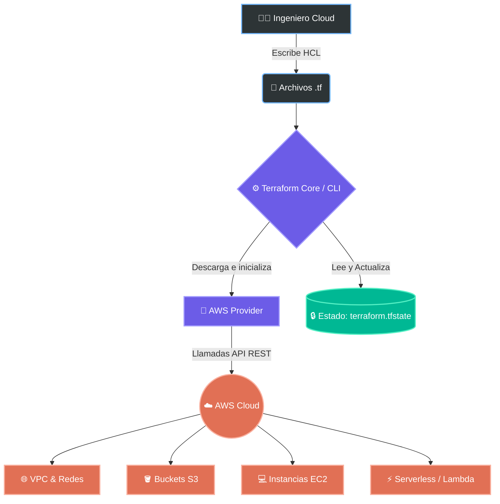

# ☁️ Curso Práctico y Arquitecturas con Terraform & AWS


Bienvenido a mi repositorio principal de prácticas y proyectos de Infraestructura como Código (IaC). Este espacio está dedicado a documentar mi aprendizaje, diseñar arquitecturas en la nube de AWS y construir proyectos escalables y modernos utilizando **Terraform**.

---

## 🏗️ ¿Cómo interactúa Terraform con AWS?

El siguiente diagrama ilustra el flujo de trabajo moderno que utilizaremos en todas nuestras prácticas. Terraform lee nuestro código declarativo, compara el estado actual y realiza llamadas a la API de AWS para aprovisionar los recursos.



---

## 🛠️ Herramientas y Requisitos Previos (Stack Moderno)

Para ejecutar las prácticas de este repositorio, asegúrate de tener las siguientes herramientas configuradas en tu entorno local:

| Herramienta | Versión Recomendada | Descripción |
| :--- | :--- | :--- |
| **[Terraform](https://developer.hashicorp.com/terraform/downloads)** | `>= 1.5.0` | Motor principal de Infraestructura como Código. |
| **[AWS CLI v2](https://aws.amazon.com/cli/)** | `Latest` | Interfaz de línea de comandos para autenticación con AWS. |
| **[TFLint](https://github.com/terraform-linters/tflint)** | `Latest` | Linter para detectar posibles errores y malas prácticas en HCL. |
| **[tfsec](https://github.com/aquasecurity/tfsec)** | `Latest` | Escáner de seguridad estático para tu código Terraform. |

> 🔑 **Nota de Seguridad:** Nunca expongas tus credenciales de AWS (`AWS_ACCESS_KEY_ID`, `AWS_SECRET_ACCESS_KEY`) en el código. Utiliza perfiles de AWS CLI o variables de entorno.

---

## 📂 Estructura del Repositorio

El curso/repositorio está dividido de forma progresiva, desde lo más básico hasta arquitecturas de nivel producción:

```bash
📦 terraform-course
 ┣ 📂 01-fundamentos        # Variables, Outputs, Providers, Recursos básicos (S3, EC2)
 ┣ 📂 02-estado-remoto      # Configuración de backend S3 + DynamoDB para el .tfstate
 ┣ 📂 03-modulos            # Creación y uso de módulos reutilizables (DRY)
 ┣ 📂 04-redes-vpc          # Creación de VPCs completas, Subredes Públicas/Privadas, NAT, IGW
 ┣ 📂 05-alta-disponibilidad# Auto Scaling Groups, Load Balancers (ALB)
 ┣ 📂 06-serverless         # API Gateway, Lambda, DynamoDB
 ┗ 📂 proyectos-finales     # Arquitecturas completas y casos de uso reales
```

---

## 🚀 Cheat Sheet: Comandos Esenciales de Terraform

Un resumen de los comandos que usaremos en nuestro día a día, siguiendo las mejores prácticas:

### 1. Inicialización y Validación
```bash
terraform init          # Inicializa el directorio, descarga providers y modulos
terraform fmt           # 🎨 Formatea el código según el estándar oficial de HCL
terraform validate      # ✔️ Verifica la sintaxis y coherencia del código
```

### 2. Ejecución (El flujo de trabajo principal)
```bash
terraform plan          # 🔍 Muestra un resumen de los cambios (0 to add, 1 to change...) sin aplicar nada
terraform plan -out=tfplan # Guarda el plan para una ejecución exacta y segura
terraform apply tfplan  # 🚀 Aplica los cambios guardados en el plan a la nube de AWS
```

### 3. Limpieza y Destrucción
```bash
terraform destroy       # 💥 Elimina toda la infraestructura definida en el código
```

---

## 🌟 Mejores Prácticas que aplicaremos

1. **Estado Remoto Seguro:** Siempre guardaremos nuestro archivo `terraform.tfstate` en un bucket S3 privado, bloqueado con DynamoDB para evitar conflictos de escritura en equipo.
2. **Código Modular (DRY - Don't Repeat Yourself):** Usaremos `modules` para no repetir el mismo código de creación de VPCs o instancias.
3. **Etiquetado Correcto (Tagging):** Todos los recursos en AWS llevarán etiquetas como `Environment`, `Project`, y `ManagedBy = "Terraform"` para control de costos.
4. **Seguridad (Least Privilege):** Evitaremos políticas abiertas (como `public-read` o `*`) a menos que sea estrictamente necesario.

---
*Hecho con ❤️ para dominar la nube y la automatización.*
